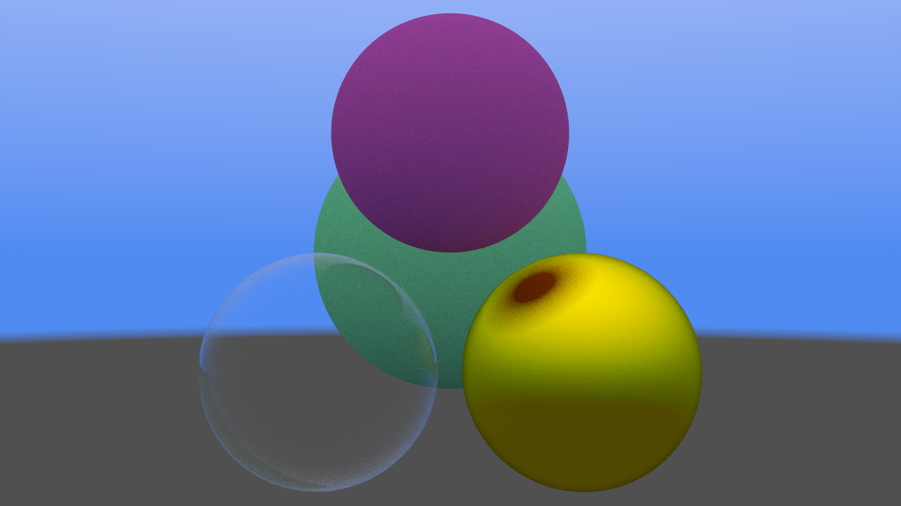

# Glim - D Raytracer library

Raytracing and rasterization of 3D scenes in D.

_examples/raytracer.d_

_examples/rasterizer.d_

Based on:

- [Ray Tracing In One Weekend](https://raytracing.github.io/)
- [Tinyrenderer](https://github.com/ssloy/tinyrenderer)
